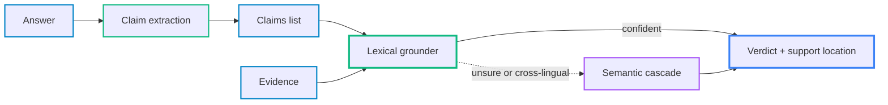
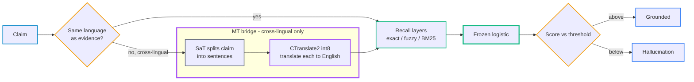

# groundrails

[](https://github.com/stellarshenson/groundrails/actions/workflows/ci.yml)
[](https://pypi.org/project/groundrails/)
[](https://pepy.tech/project/groundrails)
[](https://www.python.org/downloads/)
[](https://opensource.org/licenses/MIT)
[](https://kolomolo.com)
[](https://www.paypal.com/donate/?hosted_button_id=B4KPBJDLLXTSA)

Grounding guardrails for agentic RAG - deterministic, torch-free claim verification.

groundrails checks whether each claim in an answer is backed by your source, and tells you exactly where the support is - or flags it as a hallucination or contradiction. No LLM in the loop, runs on CPU, same answer every time.

<p align="center">
  
</p>

**In plain terms**: groundrails is a fact-checker for AI answers. For every sentence the answer states, it searches your source documents for the passage that backs it up - if it finds one it points to the exact spot, if it does not it flags the sentence as made up or contradicted. It does this by matching words and, optionally, a couple of small on-device models, so there is no second AI grading the answer, no internet call at decision time, and the same verdict every run.

## Why

Agentic RAG asserts things its sources never said; groundrails is the deterministic gate that catches it before the answer reaches the user.

- **LLM-judge cost** - a second model grading each claim is slow, one model call per claim, non-deterministic, no reason for the verdict
- **groundrails** - milliseconds per claim, no GPU, no API call at decision time
- **Auditable** - every verdict points to the exact supporting passage

## Principle of operation

groundrails grounds each claim by recall, not by an LLM judgment: a fast deterministic lexical pass decides most claims, and only the ones it is unsure about escalate to an optional model cascade.



Inside the lexical grounder, a same-language claim is recalled directly; a cross-lingual one is segmented by SaT and translated first, then a single verdict forms:



- **Lexical grounder** - exact, fuzzy, and BM25 recall fused by a frozen logistic; decides most claims on CPU in ~165 ms, no model call
- **Cross-lingual** - a same-language claim is recalled directly; a claim in another language is split into sentences by the SaT model and translated to English (CTranslate2 int8) before recall, no translation when the languages match
- **Escalation** - only an unsure or cross-lingual claim escalates to the opt-in `--semantic` cascade (embed → rerank → NLI, OpenVINO int8)
- **Verdict** - a 0-to-1 score above the threshold is grounded, below it a hallucination; a value conflict like `512` vs `1000` is a contradiction
- **Deterministic** - frozen weights, identical verdict every run

## Quickstart

```bash
pip install groundrails
groundrails init                  # provision + write groundrails.json under $GROUNDRAILS_HOME (or ./ if unset)

# extract the claims from an answer, check each against the evidence
groundrails ground answer.md evidence.txt --json
```

> [!IMPORTANT]
> groundrails grounds **plain text only** (UTF-8). Convert a PDF, DOCX, or scanned document to markdown or text first - with a separate document-processing tool - then ground the result.

You get back a **grounding document**: per claim, a verdict, a confidence score, and exactly where the support sits in the evidence - the quoted passage and its line / character offset. This is what an agent reads to cite a source or retract a claim:

```json
{
  "summary": {"total": 3, "grounded": 1, "ungrounded": 2},
  "claims": [
    {
      "claim": "The tower was completed in 1889.",
      "claim_location": {"line": 5, "char_start": 120, "char_end": 152},
      "grounded": true,
      "score": 0.94,
      "support": {
        "source_path": "evidence.txt",
        "matched_text": "the Eiffel Tower was completed in 1889",
        "line_start": 12, "char_start": 210, "char_end": 248
      },
      "contradiction": null
    },
    {
      "claim": "It draws 50 million visitors a year.",
      "claim_location": {"line": 6, "char_start": 153, "char_end": 189},
      "grounded": false,
      "score": 0.08,
      "support": null,
      "contradiction": null
    },
    {
      "claim": "The tower is 2000 metres tall.",
      "claim_location": {"line": 7, "char_start": 190, "char_end": 220},
      "grounded": false,
      "score": 0.0,
      "support": {
        "source_path": "evidence.txt",
        "matched_text": "It is 330 metres tall",
        "line_start": 13, "char_start": 250, "char_end": 271
      },
      "contradiction": {"numeric": [[2000, 330]]}
    }
  ]
}
```

A typical run mixes all three outcomes:

- **Grounded** - points at its supporting passage
- **Hallucination** - `grounded: false`, `support: null`; the evidence never made the claim
- **Contradiction** - `grounded: false` but still locates the passage it disagrees with and names the conflicting value (`2000` vs `330`)

Read it like this:

- **`grounded`** - true if the evidence backs the claim, false if it is unsupported or contradicted
- **`score`** - confidence in the verdict, 0 to 1
- **`support`** - the exact passage that backs the claim, with its source, line, and character offset
- **`contradiction`** - the conflicting value (a number or entity) when the claim disagrees with the source

Three ways to supply the claims; the rest of the positionals are always evidence:

```bash
groundrails ground answer.md evidence1.txt evidence2.txt          # claims extracted from a document
groundrails ground --claims claims.json evidence.txt              # a claims file
groundrails ground --claim "The tower is in Paris." evidence.txt  # inline (repeatable)
```

A `claims.json` is what `extract-claims` writes - a list of `{claim, ...}` objects (only `claim` is required; `id` and the location fields are optional). It can also be a plain list of strings, or a text file with one claim per line.

```json
[
  {"id": "c01", "claim": "The Eiffel Tower is in Paris.", "line_number": 5, "char_start": 120, "char_end": 152},
  {"id": "c02", "claim": "It was completed in 1889.", "line_number": 5, "char_start": 153, "char_end": 178}
]
```

Drop `--json` for a readable line per claim; add `--full-output` for the per-scorer detail. From Python:

```python
import groundrails
from groundrails import grounding_document

groundrails.init()  # provision once; grounding raises NotInitializedError until this runs

doc = grounding_document(
    ["The Eiffel Tower is in Paris."],
    [("evidence.txt", "The Eiffel Tower is located in Paris, France.")],
)
```

Cross-lingual claims and a deeper semantic check are opt-in: install `groundrails[semantic-grounder]` and add `--semantic 1`.

## What you get

- **Where the support is** - the quoted passage, source, line, and character offset for every grounded claim
- **Hallucination and contradiction flags** - claims the source never made, and value conflicts like `512` vs `1000` or `H100` vs `A100`
- **Cross-lingual checks** - a claim in one language against evidence in another, fully on-device
- **A deterministic answer with a reason** - frozen weights, same verdict every run, an auditable score behind each decision

## Languages

English is native; nine more ground through an on-device translation bridge.

- **Supported** - Danish, German, Spanish, French, Italian, Norwegian Bokmål, Dutch, Portuguese, Swedish
- **Auto-install** - the bridge model downloads on first cross-lingual use (default)
- **Offline / disabled** - with `GROUNDRAILS_ARGOS_AUTO_INSTALL=0` or `HF_HUB_OFFLINE`, a claim whose model is not installed fails with an explicit `language not installed` error, never silently mis-scored
- **Preinstall** - `argospm install translate-<code>_en`
- **Unsupported language** - blocked the same way

## Calibration

Frozen weights fit on a verified gold set ground correctly out of the box; recalibrate only on domain drift with your own labelled claims.

- **When** - document style, entity vocabulary, or language mix drifts from the gold set
- **What it touches** - re-fits the frozen logistic weights; the deterministic recall layers are untouched
- **Inference** - stays a single logistic evaluation, same input → same verdict

```bash
# write the active calibration to the JSON a deployment provisions via init
groundrails calibration export -o calibration.json
```

See [`docs/calibration-reference.md`](docs/calibration-reference.md) for the dataset format, the retrain commands, and how `init` loads the JSON.

## How it works & how it performs

Two layers: a fast deterministic lexical grounder, and an optional model-based cascade (`--semantic`) that escalates only the claims the fast path is unsure about.

| Path | macro-F1 | Avg latency / claim | Models in verdict |
|------|----------|---------------------|-------------------|
| **Lexical** (default) | 0.76 | ~165 ms | none |
| **+ Semantic** (`--semantic`) | 0.82 | ~585 ms (258 ms median) | bge-m3 → reranker → NLI, OV int8 |

- **CPU, single-thread** - figures on a 2752-claim verified gold set; semantic latency is warm (chunk vectors precomputed)
- **Full design + benchmarks** - the two SOTA write-ups, with comparison to published methods:
  - [`lexical-grounding-sota.md`](docs/experiments/lexical-grounding-sota.md) - the deterministic lexical grounder
  - [`semantic-grounding-sota.md`](docs/experiments/semantic-grounding-sota.md) - the optional model-based cascade

## Documentation

- [`docs/api-reference.md`](docs/api-reference.md) - the Python functions and the grounding-document fields
- [`docs/cli-reference.md`](docs/cli-reference.md) - the `groundrails` CLI commands, flags, and exit code
- [`docs/grounding_concept.md`](docs/grounding_concept.md) - what grounding means here and how a verdict is assembled
- the two SOTA docs above, plus the full research history under [`docs/experiments/`](docs/experiments/)

## License

MIT
