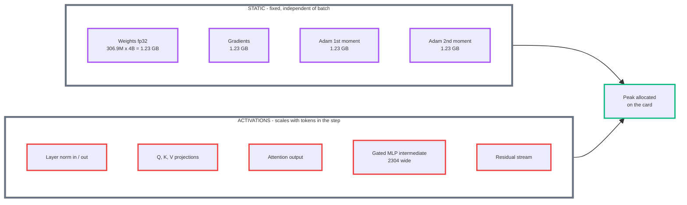
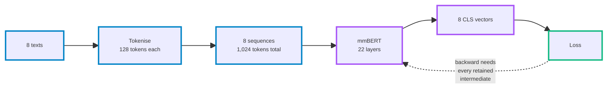
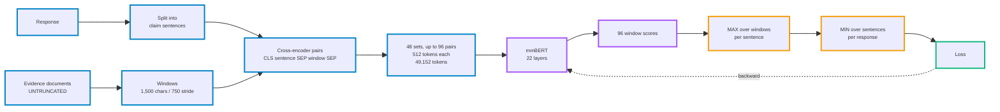
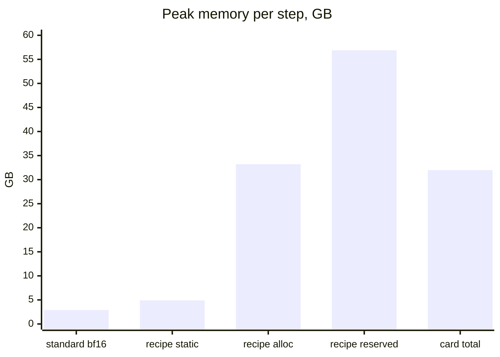
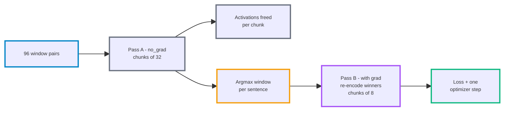

# Training Memory Anatomy - Standard mmBERT vs the Grounding Recipe

Why the same 306.9M-parameter encoder trains comfortably on a 4 GB card under a standard fine-tune and needs more than 32 GB under this project's grounding recipe. The model is identical in both cases. The difference is entirely in how many sequences one optimizer step must differentiate at once.

- **Weights are not the bill** - 306.9M parameters at fp32 is 1.23 GB, one copy, shared by every token
- **Activations are the bill** - every token produces its own intermediates at every layer, and training must retain all of them until the backward pass consumes them
- **The measured law** - peak allocated memory ≈ 3.69 GB + 0.307 GB per 512-token sequence in the step
- **The multiplier** - a standard fine-tune pushes ~1,024 tokens per step; this recipe pushes 49,152, a factor of 48

## The model

mmBERT-base (`jhu-clsp/mmBERT-base`), a multilingual ModernBERT encoder, used here as a cross-encoder.

- **22 layers**, hidden width 768, 12 attention heads, MLP intermediate 1,152 with a gated activation
- **Vocabulary 256,000** tokens - multilingual coverage, roughly eight times a monolingual BERT's vocabulary
- **306,940,417 parameters** total, of which the embedding table alone is 256,000 × 768 = **196.6M (64%)**
- **fp32 throughout** in this project - no mixed precision anywhere in the registered recipe
- The masked-language-model decoder head is discarded at load; only the encoder trunk plus a single linear scoring head is trained

The headline "307M model" is misleading about compute. Two thirds of it is a lookup table that costs storage but almost no activation memory, because a step only gathers the rows for tokens it actually saw. The 110M of transformer layers is what generates memory pressure.

## Two classes of memory

Everything on the card falls into one of two buckets, and they behave completely differently.

- **Static is ~4.9 GB and never moves** - it is the same whether the step carries 8 sequences or 96
- **Of that 4.9 GB, roughly 3.1 GB is the vocabulary table** and its optimizer state; the gradient of an embedding table is dense by default, and Adam keeps two moments of it regardless
- **Activations are retained only because of the backward pass** - `dL/dW` for a layer needs that layer's input, so nothing can be freed until backward walks back down through all 22 layers
- **Inference frees each layer's intermediates immediately** - same model, same batch, roughly a tenth the memory

## Standard fine-tune - one step

The ordinary sentence-classification shape: one text in, one label out, batch chosen freely by the practitioner.

- **Batch size is a free dial** - each text is independent, so 8 or 16 or 64 is purely a throughput and convergence choice
- **Sequence length is short** - 128 tokens covers most single sentences
- **Memory** - 1,024 tokens of activations, and with bf16 autocast and a frozen embedding table the whole step lands near 2.9 GB

## The grounding recipe - one step

The task is different: decide whether a generated response is supported by its retrieved evidence. That forces a fan-out no standard fine-tune has.

- **Evidence is never truncated** - a long retrieved document becomes many windows, and forty windows for one claim sentence is ordinary in this corpus
- **Every window is a separate 512-token sequence** through the full encoder
- **The aggregation is what forces the batch** - the sentence score is the maximum over its windows, so every window of a sentence must be scored inside the same forward pass for the maximum to exist. Batch size is dictated by the data, not chosen
- **The step is 96 sequences of 512 tokens = 49,152 tokens**, forty-eight times a standard fine-tune's 1,024

## The measured law

A probe ran the monolithic trainer on the 32 GB card and recorded peak memory against the number of pairs in each step. The points lie on a straight line.

$$\text{peak}_{\text{alloc}}(\text{GB}) \approx 3.69 + 0.307 \times n_{\text{pairs}}$$

| pairs in step | predicted GB | measured GB |
|---|---|---|
| 58 | 21.5 | 21.53 |
| 69 | 24.9 | 24.90 |
| 78 | 27.6 | 27.69 |
| 86 | 30.1 | 30.14 |
| 93 | 32.2 | 32.31 |
| 96 | 33.2 | **33.21** |

- **The intercept, 3.69 GB, is the static ledger** - weights, gradients and Adam state, dominated by the vocabulary table
- **The slope, 0.307 GB per sequence, is activations** - 512 tokens at roughly 0.6 MB per token, which is about 27 KB per token per layer, or ~6,800 fp32 values
- **At the 96-pair cap, activations are 29.5 GB of the 33.2 GB peak - 89% of the bill**

## Why 33 GB does not fit a 32 GB card, twice over

- **Allocated 33.21 GB already exceeds the card's 31.99 GB** before anything else is considered
- **Reserved peaked at 56.88 GB** - allocated is what the tensors need, reserved is what the allocator holds from the driver. Batch shapes swing step to step (58 pairs, then 96, then 74), the cached blocks fragment, and reserved runs about 1.7 times allocated
- **The probe's bar is 27.19 GB reserved**, roughly 85% of the card, leaving headroom for that fragmentation. Monolithic training misses it by more than a factor of two
- The earlier campaign measurement on the registered recipe put the unsplit peak at 36.96 GB, so only the 96 GB card can train it monolithically

## The split executor - the fix

The recipe needs to **see** 96 sequences to take the maximum. It only needs to **differentiate** the one that wins. Separating those two is the whole trick.

- **Pass A** scores every window under `no_grad` in chunks of 32; each chunk's activations are released as soon as it finishes, so nothing accumulates
- **Pass B** re-encodes only the winning windows, in gradient-bearing chunks of 8
- **Gradient-bearing sequences drop from 96 to 8**, which is the geometry of an ordinary small fine-tune, while the maximum is still taken globally over all 96
- **Predicted by the law**: 3.69 + 0.307 × 8 = **6.15 GB**. **Measured**: 6.13 GB
- The equivalence is proved before any draw is spent - split versus monolithic reference agree to within the reference-versus-reference noise floor, and the random-number fingerprints match exactly

## Locating your own run on the line

Four knobs move the number, and the registered recipe sits at the expensive end of all four.

- **Precision** - fp32 here; bf16 autocast halves every activation, so the slope becomes ~0.154 GB per sequence
- **Trainable set** - everything trains here, including the 196.6M embedding table; freezing it removes 786 MB of gradient and 1.6 GB of Adam state from the intercept
- **Sequence length** - 512 here because evidence windows are 1,500 characters; at 128 tokens the slope falls by 4x
- **Sequences per step** - 96 here, forced by the max-over-windows aggregation; a standard fine-tune picks 8

A batch of 8 sequences at 128 tokens, in bf16, with the embedding table frozen, lands near 2.9 GB. Same model, same weights, a 4 GB card. The recipe's 33 GB and that 2.9 GB are the same equation evaluated at different geometry.

## Related

- `docs/experiments/semantic-grounding-experiments.md` - the canonical experiments log; the split executor's equivalence proofs are recorded under R18-H152, R18-H156 and R19-H160
- `docs/experiments/semantic-grounding-sota.md` - the shipped recipe, including the windowed presentation and aggregation axes
