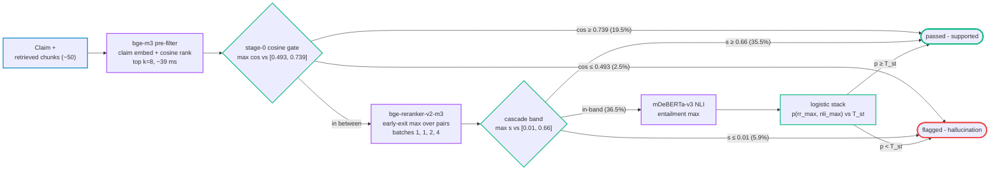

# Semantic grounder - final design

The consolidated, deployable semantic grounder: classify each claim as supported or hallucination using **two cross-encoders only** - a relevance reranker and an NLI entailment model - combined by a small logistic over their max-over-chunks scores, with a bi-encoder pre-filtering chunks to top-k in front and three adopted skip mechanisms - a stage-0 cosine gate on the pre-filter's own scores, a reranker-first cascade that skips the NLI when the reranker is decisive, and a rank-ordered early-exit inside the reranker stage - cutting warm latency 45% vs always-both at held quality (full-gold end-to-end: 585 ms mean / 258 ms median per claim, macro-F1 0.789 - see Performance characteristics). No bi-encoder *signals*, no lexical features, no fine-tuning. All models are served as **OpenVINO int8 on a single runtime** (see Serving). This is the pure model-based (semantic) pipeline; the deterministic lexical track lives separately in `lexical-grounding-sota.md` (this repo). Research record and ablation in `semantic-grounding-experiments.md`.

> Numbers are the 2,752-record organic-majority gold, out-of-fold 5-fold.

## Architecture decision

Ablation on the verified gold sets the bar by the full model's CV noise (full 6-model + lexical = macro-F1 0.814, ±0.014 fold std). The two-cross-encoder semantic stack holds within that noise while dropping four models and the lexical layer.

| configuration | models | OOF AUC | macro-F1 | note |
|---|---|---|---|---|
| full (6 models + lexical) | 6 | 0.902 | 0.814 | maximum achieved |
| 2 cross-encoders + lexical | 2 | 0.885 | 0.801 | lexical adds +0.005 - excluded (lexical track) |
| **semantic-only (2 cross-encoders)** | **2** | **0.876** | **0.796** | **shipped** - within ~1 fold-std of full |
| reranker alone | 1 | 0.840 | 0.757 | NLI adds +0.039 - essential |

- **Both cross-encoders are load-bearing** - the reranker alone is macro-F1 0.757; adding NLI lifts it to 0.796 (+0.039, far outside noise). Neither can be dropped
- **The four bi-encoders are pure footprint as signals** - together they add only +0.013 macro-F1 (in-noise); dropped as grounding signals. **bge-m3 is retained in the pipeline as the top-k pre-filter** (ranking chunks before the cross-encoders), not as a signal feeding the logistic
- **Lexical excluded by scope** - the numeric/entity contradiction + match-type flags would add +0.005, but they belong to the lexical track; the semantic pipeline is models-only
- **No-degradation margin is thin** - 0.796 is 0.018 below the full 0.814, just outside one fold-std; the quantized + pre-filtered pipeline measured end-to-end on the full gold holds 0.789 (see Performance characteristics)

## Signal ranking

Out-of-fold AUC on the 2,752 gold. The two cross-encoders carry the signal; everything below is dropped from the deployed pipeline.

| signal | kind | OOF AUC | status |
|---|---|---|---|
| bge-reranker-v2-m3 | cross-encoder rerank | **0.841** | **kept** - the lever |
| mDeBERTa-v3-base-mnli-xnli | NLI cross-encoder | 0.806 | **kept** - additive, essential |
| bge-m3 | bi-encoder | 0.730 | dropped (footprint) |
| e5-small | bi-encoder | 0.635 | dropped |
| e5-large | bi-encoder | 0.621 | dropped |
| mmBERT-base | bi-encoder | 0.529 | dropped |

## Pipeline

Claim + retrieved evidence in → grounded-probability + verdict out. The gate keys on the **max score over chunks** (only the single best-supporting chunk matters), so the work is to find that chunk cheaply and score it well.

Stage shares on the edges are the measured composition of the full-gold end-to-end run; each claim takes exactly one exit, and cost rises left to right (gate exits ~24-59 ms, reranker exits ~211-681 ms, in-band ~1,253 ms).

1. **Broad first-stage retrieval** - keep retrieval broad at ~50 chunks per claim; this is the unrecoverable recall ceiling (reranking cannot resurrect a chunk it never sees)
2. **Top-k pre-filter (50 → k=8) + stage-0 cosine gate** - score the 50 chunks with the bi-encoder already warm in the retrieval path and keep the top k=8; the single biggest latency lever (turns 50×2 cross-encoder passes into 8×2). Tighten to k=5 only after validating the best chunk survives. Use the semantic bi-encoder, not BM25 (BM25 misses the paraphrase / negation the gate cares about). The max cosine this ranking already computed doubles as a **stage-0 gate**: `cos <= 0.493` → flagged, `cos >= 0.739` → passed - 22% of claims resolve here at embed cost (~39 ms) with strictly fewer errors than the cascade alone (`COSINE_GATE` in `grounding_openvino.py`)
3. **Two cross-encoders on the k survivors, reranker first (cascade + early exit)** - the reranker scores the k pairs **in pre-filter rank order with progressive batches (1, 1, 2, 4), stopping the moment the running max crosses the pass edge** (verdict-invariant: unscored pairs cannot change a final pass verdict; mean pairs scored 4.8/8, `rerank_max_early`). The max `s` against the band **[0.01, 0.66]** routes the claim: `s <= 0.01` → flagged as hallucination (NLI skipped), `s >= 0.66` → passed as supported (NLI skipped), in-band (~35% of claims after the gate) → the NLI runs and the logistic stack gives the verdict. Easy claims pay a fraction of one cross-encoder, uncertain claims pay both (`cascade_scores` / `rerank_max_early` in `grounding_openvino.py`, frontiers in `reports/grounding_hypotheses.md`). Batch all surviving claim×chunk pairs across the whole answer into one padded forward per model:
   - **bge-reranker-v2-m3** - one relevance logit per pair (XLM-R SentencePiece tokenizer, `tokenizer(pairs,...)`, max_length 512, no token_type_ids; sigmoid only if the cached path used `normalize=True`)
   - **mDeBERTa-v3-mnli-xnli** - 3-class entailment logits (entailment / neutral / contradiction)
   - length-bucket pairs before padding (10-30% saving), run the two models concurrently (separate CUDA streams / processes - independent until the logistic)
4. **Logistic verdict** - the small fitted logistic combines each model's max-over-chunks score into the grounded-probability; weights `bge_reranker +1.19, mdeberta_nli +0.90`
5. **Two-stage loop** - the semantic gate is Stage A; on a flag, one batched LLM judge (Stage B, the few flags only) confirms unsupported vs paraphrase, then the agent revises or retracts (1-2 iterations). Not a hard gate - a hard gate drops ~1-in-5 genuine paraphrased claims

## Operating point

One out-of-fold grounded-probability. macro-F1 is the driving metric; FP (supported flagged) and FN (hallucination missed) are the operational target.

| metric | semantic stack (2 cross-enc) | best single (bge-reranker) |
|---|---|---|
| OOF AUC | **0.876** ± 0.014 | 0.841 |
| macro-F1 | **0.796** | 0.757 |
| FP - supported flagged | 266 | 237 |
| FN - hallucination missed | 203 | 294 |
| recall (hallucinations caught) | 74% | - |
| false-flag rate | 14% | - |

- **The NLI is what cuts misses** - over the reranker alone the stack drops FN 294 → 203 (the reranker over-confirms paraphrased fabrications the NLI catches as non-entailed)
- **Two uses** - a low-false-flag point for pre-display blocking, a higher-recall point for the feedback-loop re-check; re-fit the threshold per deployment
- **Cascade thresholds, two band options** - the cascade adds two fixed band edges plus the reranker-only threshold. **Quality-neutral [0.01, 0.66]** (adopted): 60% NLI skip, strictly no-worse than baseline on both errors (FP 243 vs 244, FN 217 unchanged, int8 stack). **Low-false-flag [0.05, 0.32]**: 84% skip and FP 192 (−52) at FN 279 (+62, macro-F1 0.783) - for deployments where a false flag costs more than a miss. Frontier in `reports/grounding_hypotheses.md`
- **The band is empirical, not learned** - a threshold sweep, no fitted parameters: candidate edges at the reranker-score quantiles (19 points, 5th-95th pct), each (a, b) simulated on the out-of-fold scores into a skip-rate vs macro-F1 frontier; [0.01, 0.66] is maximal skip at zero measurable loss. Same calibration class as the operating threshold (frozen-model scores only); it lives in raw reranker-score space - re-sweep on any reranker, quantization, or evidence-distribution change
- **Stage-0 gate thresholds (round 2, adopted)** - the same sweep mechanism applied to the pre-filter's max cosine: `[0.493, 0.739]` resolves 22% of claims before any cross-encoder at FP 245 / FN 216 vs the cascade's 248 / 217 (strictly fewer errors). The gate needs no pure tails - it only has to agree with the cascade verdict on the claims it absorbs. Same empirical-threshold class; it lives in bge-m3 cosine space - re-sweep on any embedder or evidence change

## Performance characteristics (measured, end-to-end)

The full adopted serving path executed once over the entire 2,752-claim gold on the deployed LATENCY-hint int8 engines, warm regime (chunk vectors precomputed), deployed calibration applied frozen (logistic fit on the pair cache; T_rr=0.313, T_st=0.584, band [0.01, 0.66], gate [0.493, 0.739]) - `scripts/run_grounder_full.py`, log `logs/grounding-full-run.log`.

**How macro-F1 works here**: the verdict is binary (hallucination vs supported) on a 29% / 71% imbalanced gold. macro-F1 is the unweighted mean of the two per-class F1 scores - the hallucination-class F1 (penalising missed hallucinations and false flags) and the supported-class F1 - so neither class can dominate by count. A grounder that flags nothing scores macro ~0.42; one that flags everything ~0.22. Both error types carry operational cost (a missed hallucination misleads the farmer, a false flag erodes trust in the assistant), which is why macro-F1 and not accuracy or single-class F1 drives every adoption decision.

**Quality (end-to-end serving, n=2,752)**:

| metric | OOF simulation (cached scores) | end-to-end serving | note |
|---|---|---|---|
| macro-F1 | 0.797 | **0.789** | -0.008, inside fold noise (±0.014) |
| FP (supported flagged) | 245 | 328 | false-flag rate 17% |
| FN (hallucination missed) | 216 | 172 | recall 72% → **78%** |

The error mix shifts toward recall in serving: the live reranker max is taken over the top-8 pre-filtered chunks while the calibration scores were max-over-all (~41) chunks, so serving scores sit slightly lower and more claims fall on the flag side; int8 batch-composition differences (progressive exit batches vs the cache's THROUGHPUT batches) add jitter. Net quality holds within noise - re-fit the thresholds on serving-derived scores if the FP/FN balance matters more than the macro.

**Latency (warm, per claim, full gold)**:

| | mean | median | p90 | p99 |
|---|---|---|---|---|
| per claim | **585 ms** | **258 ms** | 1,342 ms | 1,592 ms |

| stage path | share of claims | mean latency |
|---|---|---|
| gate-flag (cosine alone) | 2.5% | 24 ms |
| gate-pass (cosine alone) | 19.5% | 59 ms |
| rr-pass (reranker, early exit) | 35.5% | 211 ms |
| rr-flag (reranker, all pairs) | 5.9% | 681 ms |
| in-band (reranker + NLI + stack) | 36.5% | 1,253 ms |

The distribution is the design: 55% of claims finish under ~260 ms (gate or reranker pass), and the full ~1.3 s is paid only by the 37% of genuinely uncertain claims. Cold start (no chunk-vector cache) adds the evidence embedding, ~3 s/claim extra at 50 chunks - the warm numbers assume the pre-filter reuses the RAG retriever's vectors.

## Serving - single-engine OpenVINO int8

All three models run as **OpenVINO int8 IRs on one runtime** - embedder pre-filter, reranker, NLI. The choice is OpenVINO because **only NNCF can int8-quantize DeBERTa-v2**: NNCF SmoothQuant (migrate the disentangled-attention activation outliers into the per-channel weights) plus Fast Bias Correction holds the NLI signal, where ONNX-Runtime static int8 collapses it (see `deberta-v3-quantization-experiments.md`). The bge models quantize cleanly with plain NNCF int8. Build with `scripts/build_ov_grounder.py`; IRs land in `models/ov/<name>/` (IR + config + tokenizer, push-ready to HF).

| model | role | int8 method | parity vs fp32 | size |
|---|---|---|---|---|
| bge-reranker-v2-m3 | reranker | NNCF int8 | pearson **0.9976** | 571 MB |
| bge-m3 | bi-encoder pre-filter | NNCF int8 | pearson **0.9941** | 570 MB |
| mDeBERTa-v3-mnli-xnli | NLI | NNCF **SmoothQuant** (alpha 0.7) | pearson **0.9863** (full-gold **0.9841**) | 318 MB |

- **mDeBERTa int8 solved via SmoothQuant** - the stock dynamic-int8 ONNX was broken (pearson 0.35); NNCF SmoothQuant at alpha 0.7 reaches **0.9841 full-gold parity** and the re-fit stack holds **macro-F1 0.795** (vs fp32 0.796) at **318 MB** - no measurable quality loss, 3.6x smaller than fp32
- **ONNX-Runtime is not viable for the NLI** - even via a forked `onnx-neural-compressor` (crash bugs fixed) ORT static int8 of DeBERTa stays faithless (parity 0.61-0.62); hence the single engine is OpenVINO, not ORT
- **No re-fit needed** - all three int8 IRs correlate ~0.99 with the cached scores the logistic was fit on, so the fp32 calibration transfers
- **Load + score via the OpenVINO runtime** - `ov.Core().compile_model(read_model(xml), "CPU", {"PERFORMANCE_HINT":"THROUGHPUT"})`; feed `input_ids` + `attention_mask` only (no `token_type_ids`; mDeBERTa `type_vocab_size=0`). Entailment is index 0 of the 3-class head. Helpers in `experiments/grounding-semantic/grounding_openvino.py`
- **Portability** - x86-64 Intel/AMD native (int8 via AVX2 / AVX-512-VNNI); ARM (aarch64 / Graviton) via the OpenVINO ARM CPU plugin - functional but less mature, validate on the target. ORT is the more uniformly-portable engine but cannot quantize the NLI, so OpenVINO is the quality-driven choice; for x86 Lambda it is a clean fit

## Latency

All numbers are CPU OpenVINO int8 at k=8 under the `LATENCY` compile hint; warm = unique chunk vectors already cached. **Current deployed path** (stage-0 gate + reranker-first cascade + early-exit reranker), measured end-to-end on the full 2,752 gold: **mean 585 ms / median 258 ms / p90 1,342 ms / p99 1,592 ms** at macro-F1 0.789 - stage-path breakdown in Performance characteristics.

### Run history (regression reference)

One row per measured configuration, oldest first; compare any future re-measure against these to catch latency or quality regression. Absolute ms are CPU-load-sensitive (64-thread host) and samples differ per row - the per-row deltas and ratios are the stable signal, the full-gold run is the canonical reference. Re-measure by running `notebooks/07-kj-grounding-sota-benchmark.ipynb` (full gold, full metric set + confusion matrix + latency); benchmarks run as notebooks - create a new numbered notebook for any new bench configuration.

| run | config | sample | warm mean | median | p90 | quality | change |
|---|---|---|---|---|---|---|---|
| baseline k-sweep | always-both, no skips | latency-notebook sample | 1,238 ms | ~1.2 s | ~1.5 s | 0.822 macro (800-rec subset) | first int8 serving measurement - LATENCY hint adopted, k=8 chosen from the k-sweep |
| cascade bench (round 1) | + H11 cascade | 150 seed-0 | 1,184 → 857 ms | 759 ms | 1,280 ms | 0.795 OOF | reranker-first cascade adopted - NLI runs only in the uncertainty band [0.01, 0.66] |
| round-2 bench | always-both / + cascade / + gate + exit | 150 seed-0 | 1,206 / 869 / 662 ms | 1,165 / 782 / 593 ms | 1,515 / 1,329 / 1,384 ms | 0.797 OOF (gate + exit) | stage-0 cosine gate + early-exit reranker adopted (round 2) |
| full-gold end-to-end | deployed path | 2,752 gold | 585 ms | 258 ms | 1,342 ms | 0.789 end-to-end | full-gold validation of the adopted path with the frozen calibration |
| **SOTA benchmark notebook (current)** | deployed path | 2,752 gold | **492 ms** | **238 ms** | 1,103 ms | **0.789 end-to-end** | benchmark moved to the canonical notebook with the full metric set, confusion matrix and plots; verdicts identical to the script run across re-runs - latency deltas are host load |

The round-2 p90 ticks up 4% vs cascade-only - never-exit claims pay the progressive-schedule worst case; every other statistic moves down with each adopted mechanism.

### Cold vs warm and the top-k choice (historical always-both baseline)

Measured before the skip mechanisms on the always-both pipeline (`notebooks/04-kj-grounder-latency.ipynb`; quality column from `03-kj-openvino-grounder-pipeline.ipynb`, 800-record subset). Kept as the cold-regime and top-k evidence - the k=5/8/12/50 trade and the chunk-vector-cache lever have no newer measurement. The typical claim carries the full evidence set - **chunks/claim median 50, mean 40.6**.

Two regimes, distinguished by whether the chunk embeddings already exist when the claim arrives:

- **Cold** - nothing cached; the bi-encoder pre-filter must embed all ~50 evidence chunks *plus* the claim from scratch on every claim. Embedding the chunks dominates the time, so cost scales with chunk count and the top-k cut barely helps (k=8 vs all-chunks only 1.3×). This is the first time a chunk is ever seen
- **Warm** - the source-chunk embeddings are already cached (each unique chunk embedded once, keyed by content, ideally reusing the vectors the RAG retriever already computed during retrieval). The pre-filter then embeds **only the claim** and reuses the cached chunk vectors, so the only model work left is scoring the top-k pairs with the two cross-encoders - independent of chunk count. This is every subsequent claim that reuses already-seen chunks

| top-k | cold ms/claim | warm ms/claim | macro-F1 (subset) |
|---|---|---|---|
| 5 | 3764 | 864 | 0.811 |
| **8 (deployed k)** | **4293** | **1238** | **0.822** |
| 12 | 4947 | 1730 | 0.826 |
| 50 (all chunks) | 6074 | 6144 | 0.807 |

Per-claim distribution at k=8 - cold median 4.2 s / p90 5.4 s; **warm median 1.2 s / p90 1.5 s** (warm is tight because only the top-k pairs are scored, independent of chunk count). The warm column is the no-skip baseline - the deployed path's current numbers are in the run history above.

- **Cache the source-chunk embeddings (the design)** - each unique chunk is embedded once, keyed by content, and reused; ideally the pre-filter reuses the vectors the RAG retriever already computed for that chunk. This is the dominant lever: it cuts the typical claim **~4.2 s → ~1.2 s (3.6×)** and restores top-k as a real lever
- **Top-k is the lever once warm** - cold, k=8 vs all-chunks is only 1.4× (embedding dominates); warm, k=8 is **5.0×** faster than all-chunks (k=5 ~7×). Pre-filter aggressively once embeddings are cached; k=8 also slightly improves quality (drops noisy chunks)
- **Brute-force cosine, no ANN** - the pre-filter ranks the ~50 retrieved chunks with a numpy dot-product; FAISS / an ANN index only pays off for corpus-wide search (the retriever's job), not 50 chunks/claim
- **Warm latency is cross-encoder-bound** - the two large XLM-R / DeBERTa cross-encoders on the top-k pairs dominate once embedding is cached (stage means at k=8: pre-filter 38 ms, reranker 577 ms, NLI 569 ms); the three adopted skip mechanisms attack exactly that. A smaller pre-filter embedder, batching an answer's claims, or GPU fp16 (~0.15-0.4 s/claim) are the further levers. The CPU path fits async/background grading; inline blocking wants GPU or a smaller reranker

### CPU serving levers (measured)

Four mechanical levers tested on the gold (`scripts/bench_mechanical_levers.py`, 64-thread CPU); the cold/warm table above already reflects the `LATENCY` hint.

- **OpenVINO `LATENCY` hint - ~2× (the real win)** - `compile_ir` defaulted to `THROUGHPUT`, which spins up multiple async streams and is correct only for the batch/offline path; for inline single-claim serving it is **~2× slower** than `LATENCY` (the remeasure: cold k=8 dropped from ~8.8 s THROUGHPUT-era to **4.3 s**; isolated bench 6365 → 3048 ms at matched load). `LATENCY` dedicates all cores to the one request. Now the `compile_ir` default - free, no quality cost
- **`max_length` cap - void, do not lower** - chunks run ~300 tokens median / 418 p95 and (claim, chunk) pairs ~331 / ~590 p95, so the 512 cap **already truncates ~6.5% of pairs** - there is no headroom. Capping to 256 saves only ~17% and clips the median pair; `MAX_LEN` stays 512
- **Length-bucketing - kept, modest** - `rerank_max` / `nli_max` order a claim's chunks by length before batching so each padded batch wastes fewer cells; the max-over-chunks is order-invariant, so scores are unchanged. Small saving, no risk
- **k=5 vs k=8** - k=5 trims latency (warm 1.5 s vs 2.3 s) at ~0.011 macro-F1 (0.811 vs 0.822); a real but minor trade, validate the best chunk survives before tightening
- **Reranker-first cascade - adopted (-28% warm mean)** - run the reranker first and the NLI only when the reranker max falls inside the uncertainty band [0.01, 0.66]; 57% of serving claims skip the NLI (61% OOF) at macro-F1 0.795 (-0.002, inside noise). Measured warm at k=8: mean 1,184 → 857 ms, median -34%, p90 -14% (hard claims still pay both models). `cascade_scores` in `grounding_openvino.py`; bench `scripts/bench_grounder_cascade.py`
- **Stage-0 cosine gate - adopted (round 2)** - the pre-filter's own max cosine against [0.493, 0.739] resolves 22% of claims at embed cost before any cross-encoder, with strictly fewer errors than the cascade alone (FP 245/FN 216 vs 248/217). Zero added compute - the signal was being discarded. `COSINE_GATE` in `grounding_openvino.py`
- **Rank-ordered early-exit reranker - adopted (round 2)** - score the k pairs best-cosine-first in progressive batches (1, 1, 2, 4) and stop once the running max crosses the pass edge; verdict-invariant by construction (exact 150/150 on the bench). Mean pairs scored 4.8/8; the int8 forward is near-linear in batch rows (122 ms batch-1 vs 95 ms/pair batch-8) so exits keep what they save. Gate + cascade + exit together: warm mean **662 ms (-45% vs always-both)**. `rerank_max_early`; bench `scripts/bench_grounder_round2.py`
- **Fused-evidence single forward - refuted (round 2)** - packing the top evidence into ONE context and running ONE forward per cross-encoder (~211 ms/claim) collapses quality: macro-F1 0.714-0.784 across all configs. Max-over-chunks is load-bearing; do not approximate it in one forward
- **Whole-answer batching - not yet done** - the serving helpers score **per-claim** (one padded forward per claim per model); batching all of an answer's claims × top-k into one forward per model would amortise fixed overhead. Needs an answer-level scorer, not a tweak - the next mechanical lever to build

## Footprint

All three deployed as OpenVINO int8 IRs:

- **bge-reranker-v2-m3** (XLM-R-large) - int8 IR **571 MB**
- **bge-m3** (bi-encoder pre-filter) - int8 IR **570 MB**
- **mDeBERTa-v3-base-mnli-xnli** (DeBERTa-v2 base) - SmoothQuant int8 IR **318 MB** (3.6× smaller than the 1.12 GB fp32)
- **Total ~1.46 GB** for the full single-engine grounder (embedder + 2 cross-encoders), all int8 - fits a Lambda-class container. The IRs are gitignored (`models/ov/`) and synced to S3 / pushed to HF rather than committed

## Risks and mitigations

- **Single-engine = OpenVINO, with an ARM caveat** - all three int8 on OpenVINO; x86-64 (Intel/AMD) is native, ARM/Graviton via the OpenVINO ARM plugin is functional but less mature - validate on the deploy target before committing to ARM
- **Pre-filter latency only pays off warm** - the 1.3× measured is with the pre-filter re-embedding all chunks; the design's larger speedup needs the retrieval-warm embeddings reused. If retrieval does not expose them, budget the full ~8.8 s/claim (CPU) or use GPU
- **Top-k recall is unrecoverable** - missing the supporting chunk in the 50→k cut cannot be fixed downstream. Keep retrieval broad at 50; k=8 both held and slightly improved quality on the subset, but validate the best chunk survives before tightening to k=5
- **Tokenizer / revision parity** - ship the matching tokenizer with each IR (saved into `models/ov/<name>/`); feed `input_ids` + `attention_mask` only; pin the IR build against the cached-score revision
- **Empirical thresholds are distribution-bound** - the serving path now carries five fitted-on-OOF thresholds (stack threshold, reranker-only threshold, cascade band [0.01, 0.66], cosine gate [0.493, 0.739]) plus the exit schedule; all live in raw frozen-model score space. Any change to a model, quantization, k, or the evidence distribution invalidates them together - re-run the sweeps (`grounding_hypotheses.py`), they are cheap

## Limitations

- **Overlap residual needs fine-tuning** - the FN/FP that remain sit where neither cross-encoder separates support from hallucination; a fine-tuned cross-encoder is the next lever
- **Scope** - tuned for paraphrased omission/fabrication hallucinations against retrieved-doc evidence; present-but-contradicted negatives are where the lexical track's contradiction signal earns its place (excluded here by design)
- **Data-bound** - ~639 source contexts and a thin non-English tail cap further gains; more labelled hallucinations and contexts are the prerequisite
