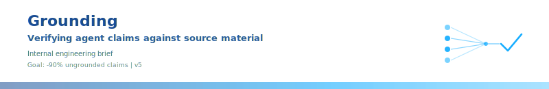

## Business overview

Agents emit claims at scale. Without grounding, the cost of those claims surfaces in three places.

**Cost**: every unverified claim either ships with a fabrication risk or triggers a downstream re-verification loop. Re-verification means more model calls, more tokens, more human review hours. Per-claim cost compounds with throughput.

**User experience**: hallucinated answers in reports, support replies, contracts erode trust on first reading. Recovery costs an order of magnitude more than the original interaction - apologies, escalations, refunds, churn.

**Latency**: ungrounded agent outputs require post-hoc review before they can be used. Review serialises the pipeline. The agent finishes in seconds; the human verifier takes hours. Time-to-decision blows up.

Grounding addresses all three:

- One scoring pass replaces N re-verification model calls (cost down).
- Per-claim verdict with cited evidence lets downstream consumers trust or challenge without re-reading the corpus (UX up).
- Lexical-first pipeline scores hundreds of claims in seconds (latency stays inside the agent's response window).

~90% reduction in unsupported output measured end-to-end. NOT FOUND verdicts are visible in the output rather than hidden in prose - the agent retries or drops the claim; the human never has to fish for it.

## Technical overview

Grounding scores how well each claim in an agent's output is supported by source text and produces a per-claim verdict with auditable evidence. Three stages: extract claims, gather evidence into a workspace, score every claim against the evidence with a multi-signal algorithm.

**Goal**: reduce ungrounded claims in agent output by 90%. Measured as the fraction of claims emitted by the agent that end up CONFIRMED against the corpus, before vs after the pipeline runs. Achieved by forcing the agent to gather evidence into `./research/` upfront (Stage 2) and rejecting unsupported claims at verification (Stage 3) - residual NOT FOUND verdicts are the work the agent must redo or the claims it must drop.

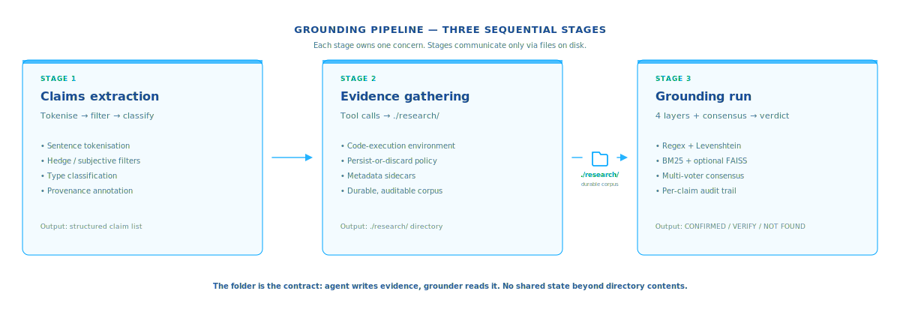

## Stage 1: Claims extraction

Only load-bearing prose is grounding-eligible. Connective phrasing, opinions, hedging - skip.

### Mechanics

1. **Tokenise into sentences.** Punctuation + whitespace heuristic or a tokeniser library (NLTK, BlingFire, spaCy). Skip code blocks and tables - not natural-language claims.
2. **Filter hedge and subjective markers.** Drop "I think", "it seems", "arguably", "perhaps", "in my opinion". Drop questions and imperatives.
3. **Classify survivors into claim types**:
   - **Quote**: starts and ends with quote marks. Verification = exact or near-exact match.
   - **Numeric**: contains a numeric token (currency, percentage, count, decimal, year, range). Needs a numeric-consistency pass on top of lexical match.
   - **Attribution**: contains "according to X", "X reported", "X said", "per X". Source must appear in the corpus alongside the attributed content.
   - **Assertion**: default. Plain declarative.
4. **Annotate provenance.** Source-paragraph index, line offset, type tag, optional 1-2 sentence context window. Verdicts reattach without re-parsing.

Output: structured claim list.

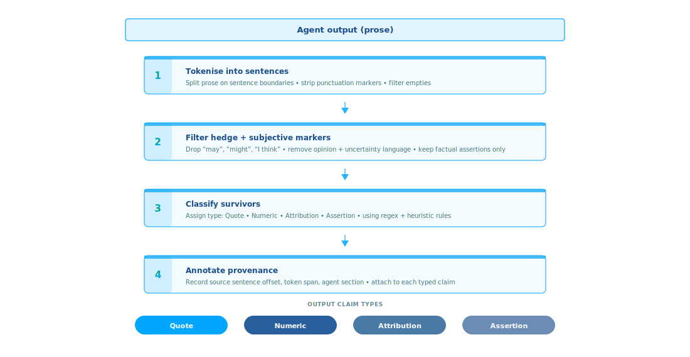

## Stage 2: Evidence gathering

The agent calls tools (web search, document fetchers, code searches, vector stores, MCP servers). Tool results that carry load-bearing material are persisted to `./research/` in the agent's working environment. The folder is the contract: agent writes, grounder reads, no shared state beyond directory contents.

### Mechanics

1. **Working directory.** Code-execution environment (Python REPL, notebook, MCP-aware sandbox) with `./research/` present and writable. Cleared between runs.
2. **Persist policy.** Per tool result: load-bearing → save; junk → discard. Local conditional in agent code, not a model turn.
3. **File shapes preserved.** Raw HTML, extracted text, JSON, PDFs, query results - written as returned.
4. **Metadata sidecar.** JSON sidecar per saved file: source URL, fetch timestamp, query string, tool name.
5. **No deduplication at write time.** Repeated content lands as separate files. Grounder treats the corpus as a multiset of passages.
6. **Durability.** Folder is the citation record. Re-runs, audits, downstream agents read the same evidence without re-calling external services.

### Why programmatic tool calling

The desk-research pattern presumes a code-execution environment, not an emit-one-`tool_use`-block-then-wait-for-re-prompt loop. Anthropic's *Code execution with MCP* (Nov 2025) reports a worked example dropping from ~150,000 tokens of model context to ~2,000 - a 98.7% reduction - when the agent calls tools from code. See <https://www.anthropic.com/engineering/code-execution-with-mcp>.

- **Intermediate results stay out of context.** Per-call model round trips pass each result through context twice (return from tool, into next prompt). Code execution keeps results as in-process objects to grep, filter, slice, or persist without round-tripping through the model. The corpus is built on disk, not in attention windows.
- **Persist-or-discard is local.** One-line conditional in agent code. A per-call model loop burns a model turn for the same decision.

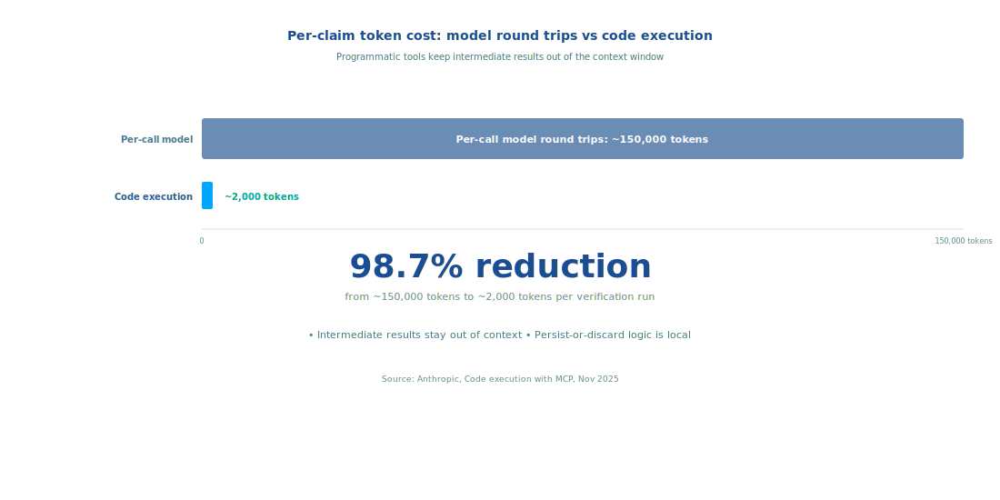

## Stage 3: Grounding run

For each claim, score support against every file in `./research/`. Multiple independent signals run in parallel; each produces a score in `[0, 1]`.

### Layer 1: Exact regex match

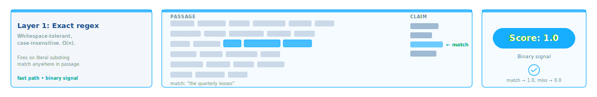

Whitespace-tolerant, case-insensitive substring search. Binary score. O(n) over corpus characters. Strongest weight for quoted claims and named entities.

### Layer 2: Fuzzy Levenshtein

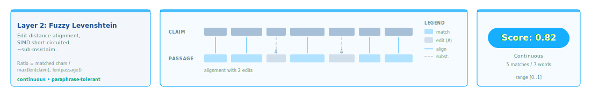

Best-matching substring across sources via edit-distance alignment (`rapidfuzz.fuzz.partial_ratio_alignment` or equivalent). Continuous score. O(n×m) worst case, short-circuited via bound-tightening; sub-millisecond per claim on commodity hardware. Catches paraphrases with close wording, typo-tolerant attributions, minor word-order shifts.

### Layer 3: BM25 lexical ranking

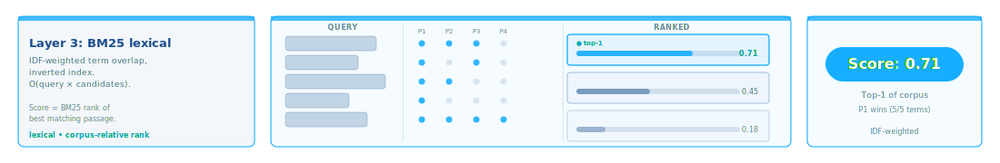

Term-overlap scoring with IDF weighting over passage chunks. Inverted-index build is O(corpus tokens) one-time; per-claim scoring is O(query tokens × candidate passages). Catches topical paraphrases where key terms survive but word order changes substantially.

### Layer 4 (optional): semantic embeddings + FAISS

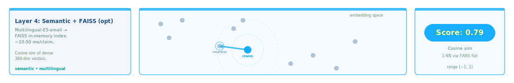

Multilingual sentence-embedding model (e.g. multilingual-E5-small) produces dense vector representations of the claim and every passage. Vectors are indexed in FAISS - flat for small corpora, IVF or HNSW for larger ones - held in memory only, rebuilt per run, discarded on exit. Nearest neighbours by cosine similarity become the candidate spans. Catches passages that mean the claim with no shared wording. Opt-in: hundreds of megabytes of model, ~10-50ms per claim.

### Consensus scoring

All layers always run. Verdict is a weighted combination with a multi-voter bonus, not the per-layer max.

Principle: real paraphrases light up multiple layers weakly. Fabrications light up at most one layer (or none). Each layer carries a voter threshold; layers above threshold count as voters; voter count multiplies into the weighted sum. A 2-voter hit at moderate strength outscores a 1-voter hit at high strength. This collapses the dominant failure mode where one signal over-confidently confirms a fabrication - a BM25 hit driven by shared rare technical terms, for example, does not survive consensus unless at least one other layer corroborates.

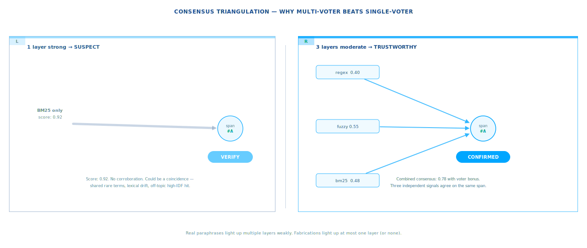

**Calibration is empirical.** Weights, voter thresholds, and bonus magnitudes are tuned against a labelled benchmark (real paraphrases, fabrications, partial-supports, off-topic distractors) via optimization on precision / recall. Hypothesis is the design input; constants are the data-science output. Re-tuning means re-running the benchmark, not editing code.

The production default is lexical mode: a trained logistic over 13-18 signals replaces the hand-tuned consensus scorer described here. Semantic+FAISS (Layer 4 above) is opt-in via `--semantic`.

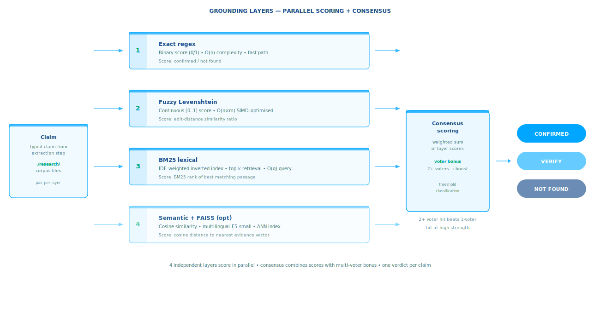

## Performance

Lexical layers - regex, Levenshtein, BM25 - are pure CPU, no model inference, no network. A few hundred claims against a multi-MB corpus completes in seconds end-to-end on commodity hardware. The BM25 inverted index is built once per run; Levenshtein dominates per-claim cost at sub-millisecond thanks to SIMD short-circuiting.

Semantic layer is the only slow component when enabled. Model inference at ~50ms per passage on CPU (~5ms on GPU); FAISS queries ~10-50ms per claim. ~100 claims against a ~10K-passage corpus runs in seconds.

Compared to LLM-based verification (one model call per claim-passage pair, ~1s minimum plus token cost): 2-3 orders of magnitude faster, with consensus scoring recovering most of the precision an LLM verifier adds.

Note: latency figures above reflect the base lexical layers in isolation. The shipped high-tier lexical engine (default) runs ~165 ms/claim warm (MT bridge dominates at ~86 ms amortized for non-English claims; English-only low tier is faster). Cold start ~5.6s first run (SaT segmenter + first MT model + WordNet).

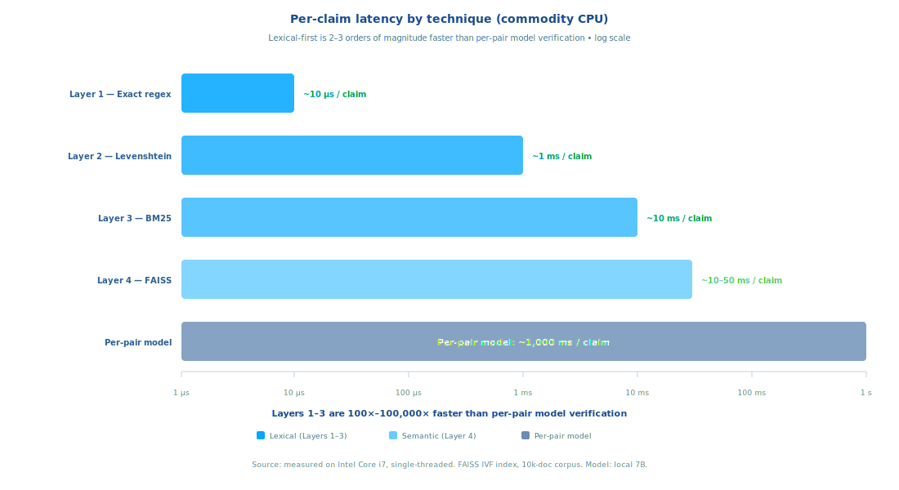

## Output

Per-claim verdict:

- **CONFIRMED**: consensus above the calibrated threshold, at least one strong layer firing. Ships with the winning span's source file, line range, and surrounding context.
- **VERIFY**: weak partial support - one or more layers fired below threshold, or layers disagree. Ships with which layers fired and why a reviewer should recheck.
- **NOT FOUND**: no layer above its floor. No evidence in `./research/` - fabricated or pulled from training data without a source.

Every verdict carries its per-layer scores. The output is the audit trail, not just the conclusion.

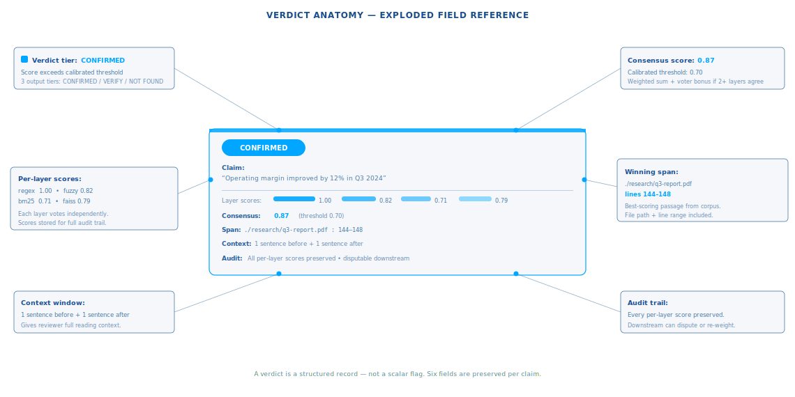

## Limitations

- Verdicts are only as good as the corpus. NOT FOUND means no evidence here, not that the claim is false.
- Fuzzy and BM25 over-fire on dense technical text where rare terms repeat across many passages.
- Semantic embeddings reduce false negatives but add latency, memory footprint, and a model-download dependency.
- Numeric claims need a dedicated post-pass: "\\$2M" fuzzy-matches "\\$2 trillion" because number-shaped tokens align; numeric-consistency check over CONFIRMED claims catches this.

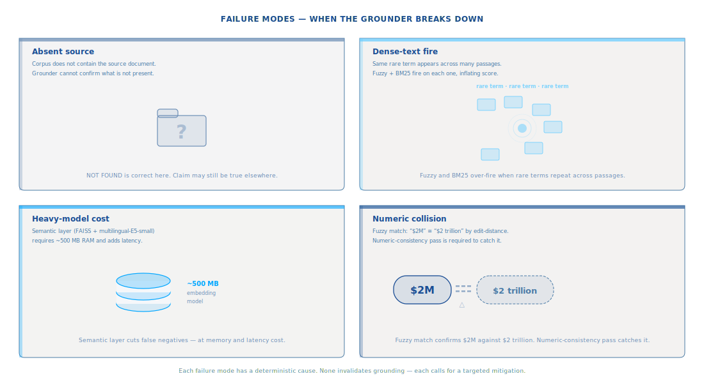
